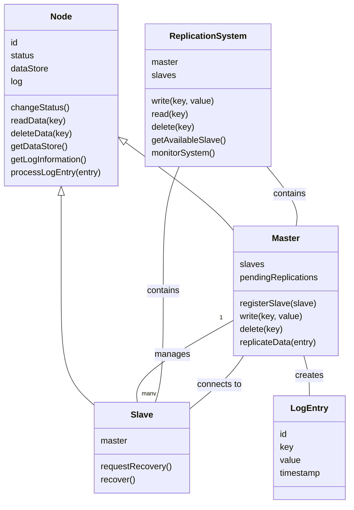
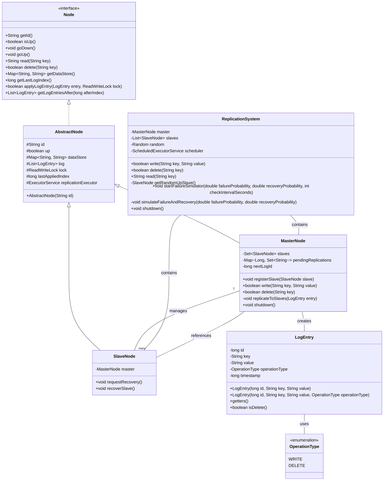
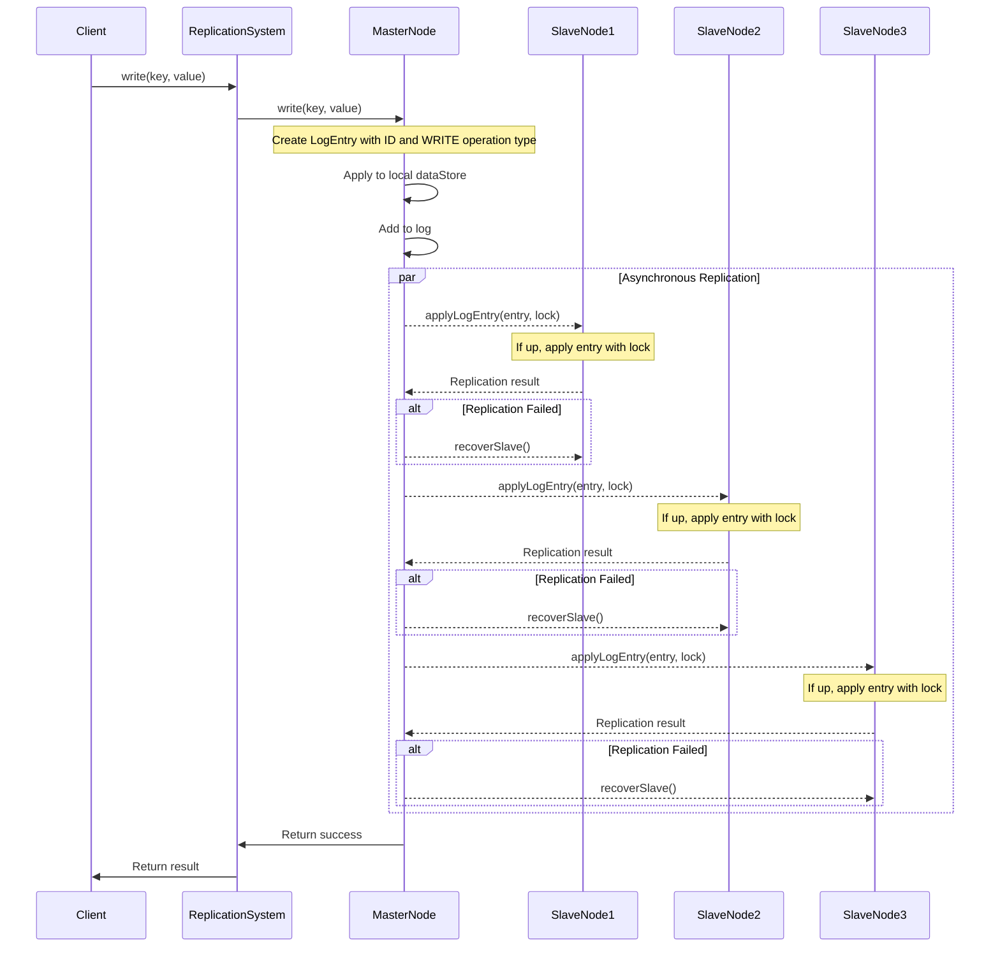
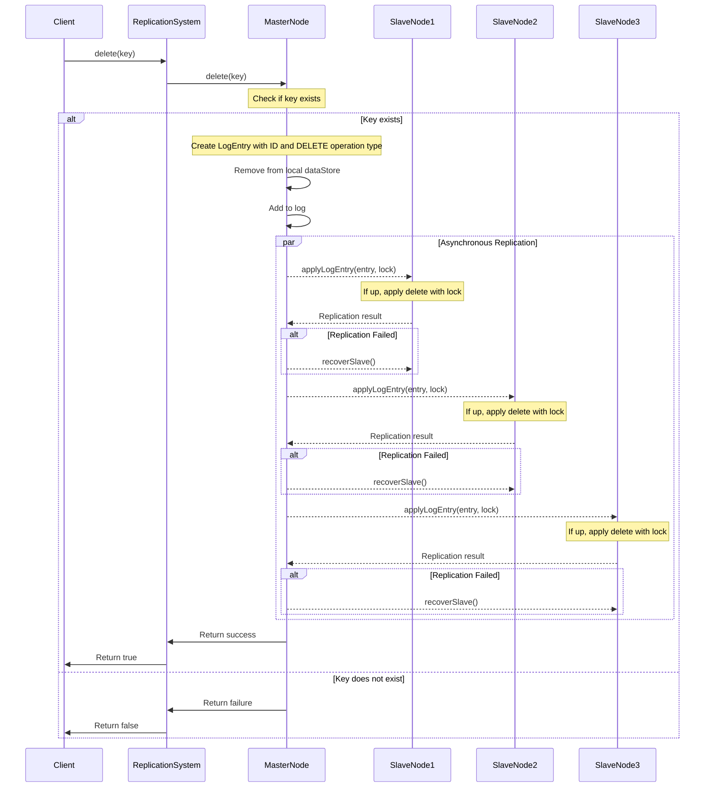
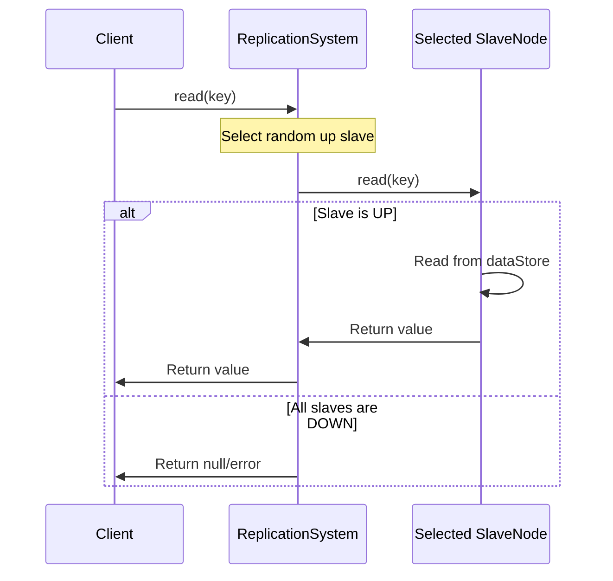
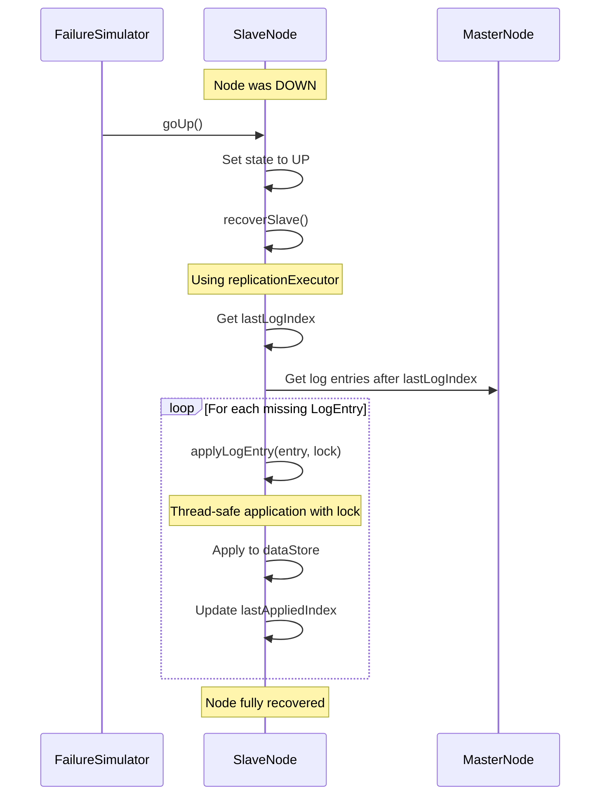
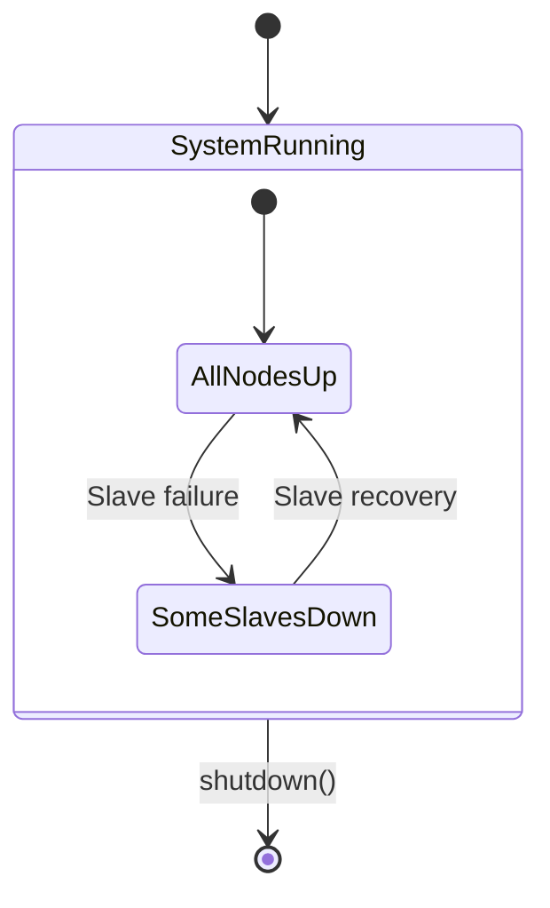
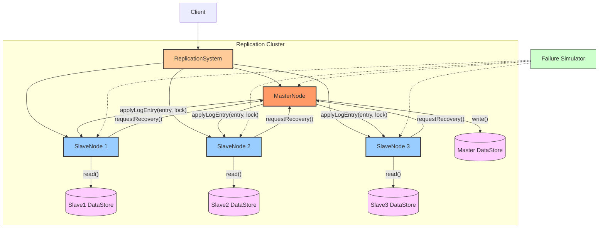

# Master-Slave Replication System Diagrams

## Analysis Class Diagram

## State Charts

```mermaid
stateDiagram-v2
    direction LR
    [*] --> SystemInitializing: System Created
    SystemInitializing --> SystemRunning: Initialization Complete
    SystemRunning --> SystemShuttingDown: shutdown() called
    SystemShuttingDown --> [*]: Resources Released
    
    state SystemRunning {
        direction LR
        [*] --> AllSlavesUp
        
        AllSlavesUp --> SomeSlavesDown: Slave Failure(s)
        SomeSlavesDown --> AllSlavesUp: All Slaves Recovered
        
        state AllSlavesUp {
            direction LR
            
            state MasterNodeState {
                direction TB
                [*] --> Master_Idle
                Master_Idle --> Master_Processing_Write: write() called
                Master_Idle --> Master_Processing_Delete: delete() called
                Master_Processing_Write --> Master_Idle: Write Replication Complete
                Master_Processing_Delete --> Master_Idle: Delete Replication Complete
                
                state Master_Processing_Write {
                    [*] --> Master_CreatingWriteLogEntry
                    Master_CreatingWriteLogEntry --> Master_UpdatingLocalStore
                    Master_UpdatingLocalStore --> Master_Replicating
                    Master_Replicating --> [*]
                }
                
                state Master_Processing_Delete {
                    [*] --> Master_CreatingDeleteLogEntry
                    Master_CreatingDeleteLogEntry --> Master_RemovingFromLocalStore
                    Master_RemovingFromLocalStore --> Master_Replicating
                    Master_Replicating --> [*]
                }
            }
            
            state AllSlaveNodesState {
                direction TB
                state "SlaveNodeStates" as SlaveCompound {
                    [*] --> Slaves_Idle
                    
                    Slaves_Idle --> Slaves_Reading: read()
                    Slaves_Reading --> Slaves_Idle
                    
                    Slaves_Idle --> Slaves_ReceivingLogEntry: applyLogEntry()
                    Slaves_ReceivingLogEntry --> Slaves_ApplyingLogEntry
                    Slaves_ApplyingLogEntry --> Slaves_CheckingOperationType
                    Slaves_CheckingOperationType --> Slaves_StoringData: Write Operation
                    Slaves_CheckingOperationType --> Slaves_DeletingData: Delete Operation
                    Slaves_StoringData --> Slaves_Idle
                    Slaves_DeletingData --> Slaves_Idle
                }
            }
            
            state ReplicationSystemState {
                direction TB
                [*] --> System_Idle
                System_Idle --> System_Write: write() requested
                System_Idle --> System_Delete: delete() requested
                System_Idle --> System_Read: read() requested
                System_Read --> System_Idle
                System_Write --> System_Idle
                System_Delete --> System_Idle
            }
            
            MasterNodeState --> AllSlaveNodesState: Replication
            ReplicationSystemState --> MasterNodeState: write()
            ReplicationSystemState --> AllSlaveNodesState: read()
        }
        
        state SomeSlavesDown {
            direction LR
            
            state "Master State" as MasterWithSlavesDown {
                direction TB
                [*] --> MasterLimitedOps
                MasterLimitedOps --> MasterWrite: write() called
                MasterLimitedOps --> MasterDelete: delete() called
                MasterWrite --> MasterReplicatePartial
                MasterDelete --> MasterReplicatePartial
                MasterReplicatePartial --> MasterLimitedOps
            }
            
            state "Slave Nodes" as SlaveNodesWithFailures {
                direction TB
                [*] --> ActiveSlaves
                ActiveSlaves --> FailedSlaves: Failure
                FailedSlaves --> SlaveRecovering: goUp()
                SlaveRecovering --> ActiveSlaves: Recovery Complete
                
                state SlaveRecovering {
                    [*] --> RequestingRecovery
                    RequestingRecovery --> FetchingMissingLogs
                    FetchingMissingLogs --> ApplyingMissingLogs
                    ApplyingMissingLogs --> [*]
                }
            }
            
            state "System State" as SystemWithFailures {
                direction TB
                [*] --> LimitedOperations
                LimitedOperations --> FailoverReads: read()
                FailoverReads --> LimitedOperations
                LimitedOperations --> PartialWrite: write()
                LimitedOperations --> PartialDelete: delete()
                PartialWrite --> LimitedOperations
                PartialDelete --> LimitedOperations
            }
            
            MasterWithSlavesDown --> SlaveNodesWithFailures: Partial Replication
            SystemWithFailures --> MasterWithSlavesDown: write()
            SystemWithFailures --> SlaveNodesWithFailures: read()
        }
    }
    
    note right of SystemRunning
        Master node is always UP
        Only slaves can fail
    end note
```

## System Architecture

## Write Flow

## Delete Flow

## Read Flow

## Node Recovery Process

## System State Diagram

## Data Flow Overview

